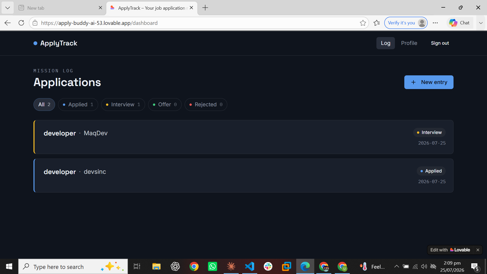
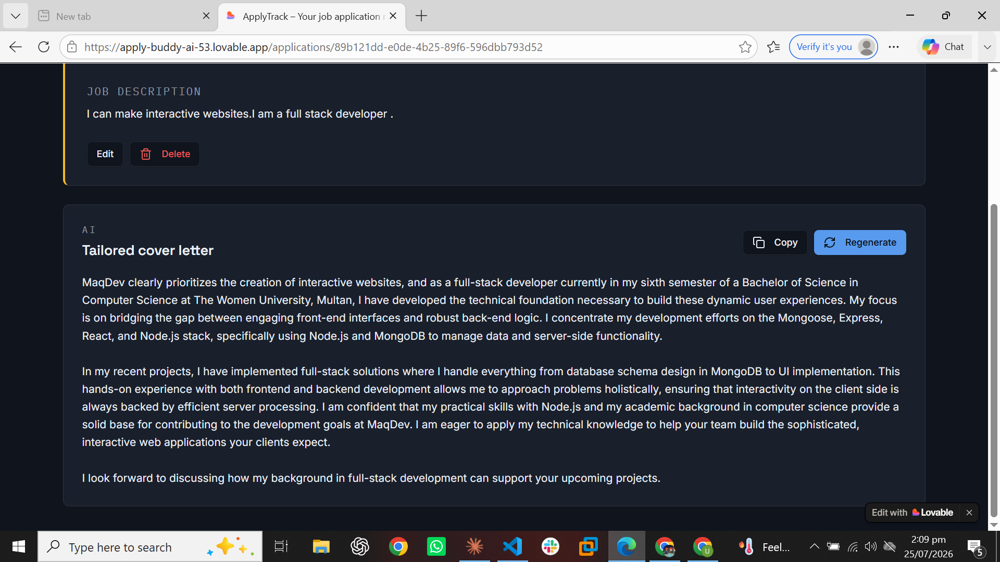

# ApplyTrack — Your Job Hunt Mission Log

**Live app:** https://apply-buddy-ai-53.lovable.app/auth
**Repo:** https://github.com/ummehabiba3819-droid/apply-buddy-ai-53

## The problem I'm solving, and who it's for

I built ApplyTrack because job hunting gets messy fast. When you're applying to multiple jobs or internships at once, your applications end up scattered across emails, spreadsheets, and sticky notes, and it's easy to lose track of what you applied to, when, and what stage it's at. On top of that, writing a genuinely tailored cover letter for every single application takes so long that most people either skip it or send the same generic letter everywhere — which hurts their chances.

I made ApplyTrack for job and internship seekers (including myself) who are managing several active applications at once and want one place to track everything, plus a fast way to get a cover letter that's actually specific to each job instead of generic filler.

## What you can do in this app

- **Create an account and sign in** — either with email and password, or with "Continue with Google." Your data is private to you specifically — I set this up using Postgres Row Level Security on the database, so it's enforced at the database level, not just hidden in the interface.
- **See all your applications on one dashboard** — everything you've logged, newest first, with live counts showing how many are in each stage.
- **Filter by status with one click** — switch between Applied, Interview, Offer, Rejected, or view everything at once.
- **Log a new application** — enter the company, role, the full job description, the status, the date you applied, and any notes you want to remember.
- **Open any application to see its full details** — read back the job description and your notes, edit any field if something changes, or delete the entry (I added a confirmation step so you can't delete something by accident).
- **Save your background once, on the Profile page** — paste in your resume, skills, and experience in your own words. You only have to do this once; every AI feature reuses it instead of asking you to retype your background for every application.
- **Generate an AI-tailored cover letter for any application** — this is the core AI feature, explained below. You can regenerate it as many times as you want, and copy the finished text with one click.

## The AI feature — how it works

On any application's detail page, there's a "Generate cover letter" button. When you click it, the app takes your saved background from the Profile page and combines it with that specific job's description, then sends both to an AI model with a system prompt I wrote myself. The model writes a 200–300 word cover letter that references real details from both — not a generic template with your name swapped in.

**Model used:** `google/gemini-3-flash-preview`, called through the Lovable AI Gateway. This call happens entirely server-side, so the API key is never exposed to anyone using the app in their browser.

**The system prompt I wrote** (this lives in `src/lib/ai.functions.ts` in the repo):

```
You are a career-writing assistant inside ApplyTrack, an app that helps job seekers manage applications. Your one job is to write a tailored cover letter for a specific job application.

You will be given:
1. The candidate's background (their own words — skills, experience, projects, education)
2. The job description they are applying to
3. The company name and role title

Rules you must follow:
- Write 200-300 words, in plain paragraph form (no headers, no bullet points, no markdown, no placeholders like "[Your Name]").
- Open by referencing something specific and real from the job description or company — never a generic "I am excited to apply" opener.
- Connect 2-3 specific things from the candidate's background to specific requirements or responsibilities mentioned in the job description. Be concrete, not vague.
- NEVER invent skills, experience, projects, or qualifications the candidate did not mention in their background. If their background is thin for this role, work honestly with what's there rather than fabricating.
- Avoid cliches and empty phrases such as "I am a hard worker," "team player," "perfect fit," "passionate about," used without specific evidence backing them up.
- Write in first person, as the candidate, in a natural and confident tone — not stiff or overly formal.
- End with a short, direct closing line (no "Sincerely, [Name]" signature block needed).

Output ONLY the cover letter body text. No preamble, no explanation, no quotation marks around it.
```

I wrote these rules specifically to stop the AI from inventing experience I don't have, and to stop it from producing the kind of generic cover letter that sounds like every other cover letter — which was the whole point of building this instead of just writing letters by hand.

## What I used to build this

- **Framework:** TanStack Start (React 19) with Vite
- **UI:** Tailwind CSS v4, shadcn/ui (built on Radix primitives), lucide-react for icons
- **Database:** Supabase Postgres, with Row Level Security policies so each user can only ever access their own rows
- **Authentication:** Supabase Auth — email/password and Google OAuth
- **AI model:** Google Gemini (`gemini-3-flash-preview`), accessed through the Lovable AI Gateway
- **Validation:** Zod, for checking data shape at runtime
- **Server functions:** TanStack Start's `createServerFn`, which is what keeps the AI Gateway key server-side and out of the browser
- **App builder:** Lovable
- **Hosting:** Lovable Cloud

## Screenshots

## Screenshots





## How to run this project yourself

**You'll need:** Node.js (or Bun), a Supabase project, and a Lovable AI Gateway key.

1. Clone the repo:
   ```
   git clone https://github.com/ummehabiba3819-droid/apply-buddy-ai-53.git
   cd apply-buddy-ai-53
   ```
2. Install dependencies:
   ```
   npm install
   ```
   (or `bun install` — the repo includes a `bun.lock`)
3. Create a `.env` file in the project root:
   ```
   VITE_SUPABASE_URL=your-supabase-project-url
   VITE_SUPABASE_PUBLISHABLE_KEY=your-supabase-anon-key
   SUPABASE_URL=your-supabase-project-url
   SUPABASE_PUBLISHABLE_KEY=your-supabase-anon-key
   LOVABLE_API_KEY=your-lovable-ai-gateway-key
   ```
   The Supabase URL and anon key are safe to expose in the browser by design — they're protected by Row Level Security, not secrecy. The `LOVABLE_API_KEY` is different: it's only used in server functions and must be kept secret.
4. Apply the database schema in `supabase/migrations/` to your own Supabase project (via the Supabase CLI, or by running the SQL directly in the Supabase SQL editor). This sets up the `applications` and `profiles` tables along with their RLS policies.
5. Start the dev server:
   ```
   npm run dev
   ```
6. Open the local URL shown in your terminal, sign up for an account, save your background on the Profile page, then log an application and try generating a cover letter.

## Live deployment

The live version is hosted on Lovable Cloud:
**https://apply-buddy-ai-53.lovable.app/auth**

Anyone can open this link and use the app — no invitation needed.
